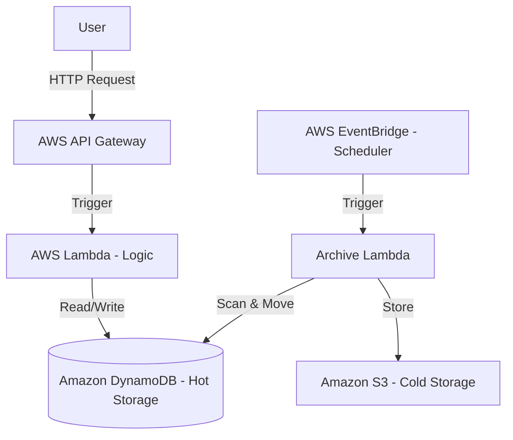

# Serverless URL Shortener (AWS Cloud-Native)

## 👤 Developer Profile & Motivation

- **Background:** 2nd-year Computer Science student.
- **Goal:** Build a portfolio project that mirrors the engineering standards of top-tier tech companies (e.g., Google).
- **Motivation:** Transitioning from "writing code" to "designing systems." This is a learning journey to master cloud architecture and "Design Doc First" workflows.
- **Mentor Support:** Guided by a Senior Engineer at Google; following strict mandates for Serverless architecture and Infrastructure as Code.

## 🏗 System Architecture



## 🛠 Tech Stack

| Component | Technology |
|-----------|------------|
| Compute | AWS Lambda (Python) |
| API | AWS API Gateway |
| Database | Amazon DynamoDB |
| Storage Tier | Amazon S3 (Archival) |
| Deployment | AWS SAM (Infrastructure as Code) |
| Algorithm | Base62 Encoding |

## 📂 Project Structure

```
/src        - Lambda function code
/designs    - Design Documents (ADRs) and Architectural decisions
/tests      - Pytest suite (Unit & Integration)
template.yaml - AWS SAM infrastructure definition
```

## 📝 Design Documents Index

List of completed/pending Design Docs:

- [ ] Shortening Algorithm
- [ ] Database Selection
- [ ] Custom Aliases
- [ ] Storage Tiering Strategy

## 🚀 How to Run

Requires AWS CLI and AWS SAM CLI.

```bash
sam build && sam deploy --guided
```
